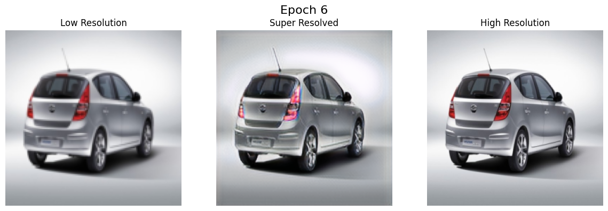

# SRGAN - Super-Resolution GAN (PyTorch)

This repository implements a Super-Resolution Generative Adversarial Network (SRGAN) using PyTorch, based on the paper:  
"Photo-Realistic Single Image Super-Resolution Using a Generative Adversarial Network" by Ledig et al.  
arXiv:1609.04802 — https://arxiv.org/abs/1609.04802

---

## Objective

Train a GAN to generate high-resolution images from low-resolution inputs using adversarial training and perceptual (VGG-based) loss.

---

## Dataset

- High-resolution images: 256×256
- Low-resolution image:128x128

---

## Model Architectures

### Generator Architecture

```text
1. Initial 7×7 Convolution
   - Input Channels: 3
   - Output Channels: 64
   - Kernel Size: 7×7
   - Padding: 3
   - Activation: (ReLU / LeakyReLU as per ConvBlock)

2. 8 Residual Blocks
   - Each with:
     - 2 Convolutions (3×3)
     - Skip connection
     - BatchNorm (if used in ResidualBlock)

3. 3×3 Convolution + Skip Connection
   - Adds back the initial features (residual learning)

4. Upsampling
   - One UpsampleBlock using PixelShuffle
   - Scale Factor: 2× (note: only one, not ×4)

5. Final 9×9 Convolution
   - Output Channels: 3
   - Kernel Size: 9×9
   - Padding: 1 (should ideally be 4 to preserve spatial dims)
   - Activation: Sigmoid
```
---
### Discriminator Architecture
```text 
1. Series of Convolutional Blocks
   - Input Channels: 3 → 64 → ... → 512
   - Kernel Size: 3×3
   - Stride alternates between 1 and 2: (1, 2, 1, 2, ...)
   - Padding: 1
   - Activation: LeakyReLU
   - BatchNorm: Used after first block onwards

2. Adaptive Average Pooling
   - Output Size: 8×8

3. MLP Classifier Head
   - Flattened input: 512×8×8 = 32768
   - Linear → 1024 → LeakyReLU(0.2)
   - Linear → 1 (scalar output for Real/Fake)
```

---

## Training Details


- GAN training with:
  - VGG perceptual loss × 0.006
  - Adversarial loss (BCE) × 1e-3
- Optimizer: Adam (lr = 1e-4)
- Batch size: 16
- Visualization and checkpointing after every few epochs

---

## Evaluation Metrics (After 5 Epochs)

- PSNR: 18.82 dB
- SSIM: 0.0649

These values are expected at early stages of training. Visual results demonstrate alignment with high-resolution ground truth.

---

## Sample Results



---

---

## References

- SRGAN Paper: https://arxiv.org/abs/1609.04802
- Perceptual Losses for Image Transformation: https://arxiv.org/abs/1603.08155

---

## Notes

- Dataset used: ~67,500 images for training, ~35 for validation
- Early stage results still provide recognizable super-resolved images
